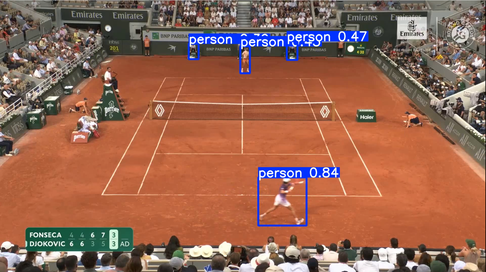

# Análise de Tênis 

## Introdução
Projeto voltado à análise esportiva preditiva aplicada ao tênis, utilizando visão computacional e aprendizado de máquina para extrair métricas de desempenho em partidas. A solução analisa vídeos para medir velocidade dos jogadores, velocidade dos golpes, quantidade de trocas de bola e índice de erros. O sistema utiliza o algoritmo YOLO para detecção de jogadores e bola, além de redes neurais convolucionais (CNNs) para identificação de pontos-chave da quadra. O projeto integra técnicas de detecção, rastreamento e análise esportiva, com foco em aplicações de analytics e IA no esporte.

* Modelo de pontuação ponderada: cada jogador recebe um score combinando velocidade média da bola (peso 40%), número de tacadas (35%) e mobilidade em quadra (25%), com normalização de escala entre as métricas;
* Evolução tacada a tacada: o histórico de probabilidades é recalculado a cada tacada detectada e plotado num gráfico de linha, mostrando como as chances de cada jogador mudam ao longo da partida;
* Formato de casa de apostas: as probabilidades são convertidas em odds decimais (ex: 63% → 1.59x);
* Painel standalone: o HTML gerado embute imagens em base64 e abre automaticamente no navegador — nenhum servidor necessário.

## Modelos usados
* YOLO v8 - Detecção dos jogadores 
* YOLO    - para detecção de bolas de tênis
* CNN     - pontos-chave da quadra

* Modelo Treinado YOLOV5 : https://drive.google.com/file/d/1UZwiG1jkWgce9lNhxJ2L0NVjX1vGM05U/view?usp=sharing
* Modelo dos pontos-chave da quadra: https://drive.google.com/file/d/1QrTOF1ToQ4plsSZbkBs3zOLkVt3MBlta/view?usp=sharing

## Treinamento
* Detecção bola de tênis com YOLO: training/tennis_ball_detector_training.ipynb
* Pontos-Chave da quadra com Pytorch: training/tennis_court_keypoints_training.ipynb

* Análise de golpes (shot_analysis.py)

Módulo de análise dos golpes detectados na partida, complementando as estatísticas da pipeline base.

Como rodar

bash# 1. Processa o vídeo e gera as estatísticas (training_data/stats.csv)
python main.py

# 2. Gera o painel de odds e abre no navegador
python generate_odds_panel.py

##Requirements

Python 3.8+
ultralytics
pytorch
pandas
numpy
opencv-python
